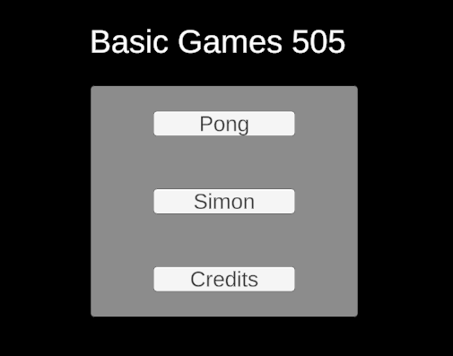
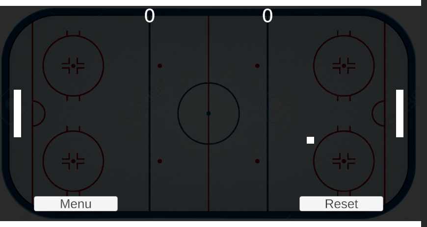
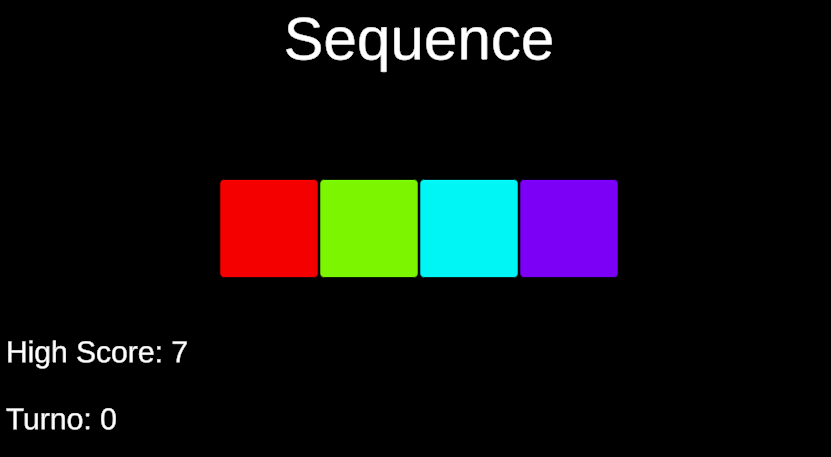
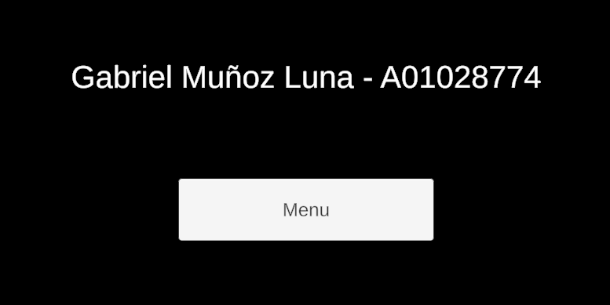

# Actividad 4.3.1 Basic Videogame Concepts

En esta actividad se hizo un juego de pong y un simon dice en unity.

# Instalacion 

1. Clonar el repositorio

```sh
git clone git@github.com:Toootiz/A01028774_TC2005B.git 
```

2. Cargar la carpeta de juego en Unity, la carpeta es Clase dentro de Videojuegos


## Pantalla de in inicio

La pantalla de inicio tiene tres botones que cuentan con el juego de pong, el juego de simon y los creditos.

<p align="center">
    
</p>

## PONG

El juego de pong comienza con el primer boton y se juega con la teclas w y s t las flechas arriba, abajo.

<p align="center">
    
</p>

### Botones de pong

El juego tiene dos botones que son para resetear y volver a jugar, tambien tiene marcador de cuantos putosd lleva cada lado.

## Simon dice 

Para simon dice es en el segundo boton 

<p align="center">
    
</p>

### Juego

Repetir la secuencia de colores hasta fallar.

### Puntos y perder 

El juego tiene el contador de cuantos puntos se lleva y cual es el puntaje maximo, una vez que pierdes te lelva a otra pantalla de reiciar y de volver al menu.

## Creditos

El tercer boton del menu son los creditos 

<p align="center">
    
</p>
